# Oracle Integration Cloud チュートリアル: RESAS-API のデータを Oracle ADW に保存する

2020年6月

このチュートリアルは、 Oracle Integration Cloud を使用して [RESAS-API が提供する市区町村データ](https://opendata.resas-portal.go.jp/docs/api/v1/cities.html) を、Oracle ADW 上の `CITIES` という名前の表に保存してみます。

## 前提

このチュートリアルに沿って作業を進めるためには、次の設定が完了している必要があります。

* Oracle Integration Cloud と Oracle Autononmous Database (ADW) のインスタンス作成
* 市区町村データを格納する Oracle ADW の表の作成
* RESAS-API の API キーの取得

### インスタンスの作成

このチュートリアルは、Oracle Integration Cloud と Oracle ADW のインスタンスの作成が完了し、コンソールにログインていることを前提としています。
まだインスタンスを作成していない場合は、次のページを参照してインスタンスを作成してください。

* [Oracle Integration Cloud インスタンスの作成](https://community.oracle.com/docs/DOC-1037470)
* Oracle ADW インスタンスの作成

### 表の作成

このチュートリアルでは、`CITIES` 表を使用します。
`CITIES` 表には、次の3つの列が定義されています。

| 列名 | データ型 | Null値の指定 | 備考 |
|:----|:----|:---:|:----|
| `PREF_CODE` | `NUMBER` | 不可 | |
| `CITY_CODE` | `VARCHAR2(10)` | 不可 | 主キーに設定 |
| `CITY_NAME` | `VARCHAR2(30)` | 不可 | |
| `BIG_CITY_FLAG` | `VARCHAR2(1)` | 不可 | |

### RESAS-API の API キーの取得

RESAS-APIを利用するには API キーが必要です。
API キーは、[利用登録](https://opendata.resas-portal.go.jp/form.html)することで取得できます。

### このチュートリアルの表記方法

このチュートリアルで使用している表記方法は次のとおりです。

| 表記方法 | 説明 |
|:----|:----|
| **「太字」** | ボタン、各種フィールドのラベルなどの GUI 要素 |
| <プレースホルダ> | 使用する環境などによって置き換える部分を表すプレースホルダー |
| `固定幅フォント` | 実行するコマンド、URL、サンプルコード、入力するテキスト |

## 接続の作成

Oracle Integration Cloud では、使用する API やデータベースなどへのアクセス情報を "接続" として定義します。
Oracle Integration Cloud は、多数のアダプタを提供しており、アクセスに必要な情報を入力するだけです。

このチュートリアルでは、２つの接続を作成します。

* RESAS-API 呼び出すための REST アダプタを使用した接続
* Oracle ADW アダプタを使用した接続

### RESAS-API 呼び出すための REST アダプタを使用した接続

最初に作成するのは、 RESAS-API を呼び出すための REST アダプタ接続です。
REST アダプタ接続を作成する手順は次のとおりです。

1.  Oracle Integration Cloud の **「ようこそ」** または **「ホーム」** ページを開いている場合は、ナビゲーション・ペインで **「統合」** をクリックします。

    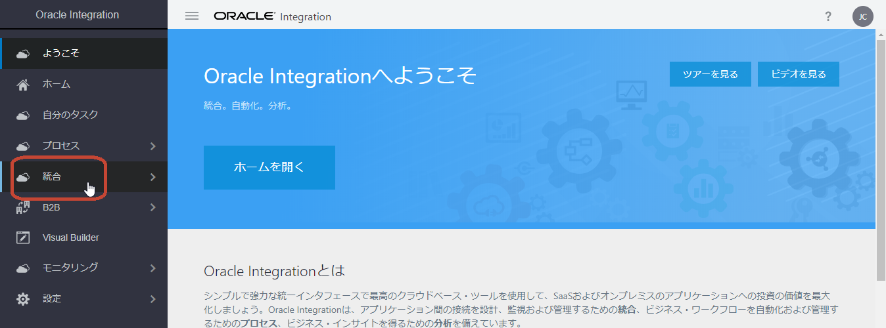

    ナビゲーション・ペインに **「統合」** に関連するメニューが表示されます。
    **「接続」** をクリックします。

    

1.  Oracle Integration Cloud の **「接続」** ページが表示されたら、ページの右上にある **「作成」** ボタンをクリックします。

    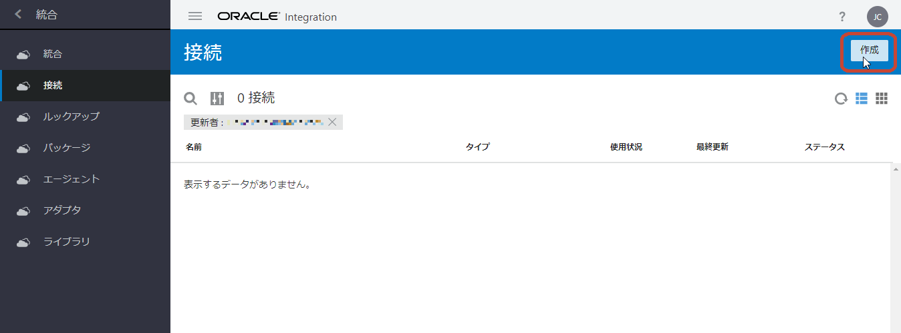

1.  **「接続の作成 - アダプタの選択」** ボックスが表示されます。

    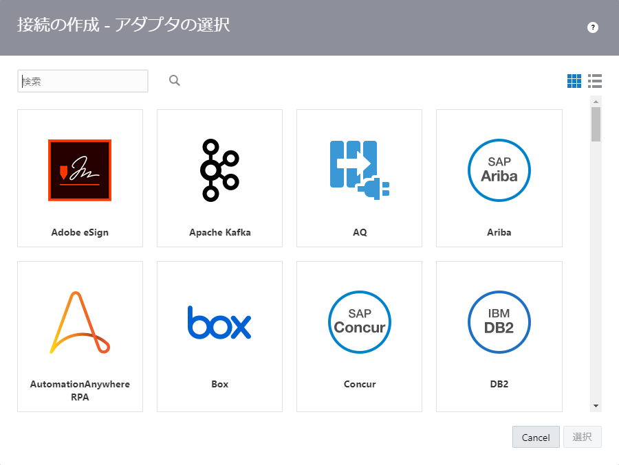

1.  **「検索」** フィールドに `REST` と入力して、表示を絞り込みます。
    表示された **「REST」** アイコンをクリックしてから右下の **「選択」** ボタンをクリックします。

    

1.  **「接続の作成」** ボックスが表示されます。
    作成する接続の基本情報を入力します。

    | 入力項目 | 入力する値 |
    |:----|:----|
    | **「名前」** | `RESAS-API` |
    | **「識別子」** | `RESAS-API` （「名前」を入力すると自動的に設定されます） |
    | **「ロール」** | **「呼び出し」** を選択 |

    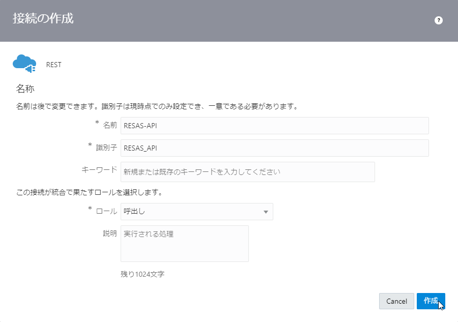

    入力したら右下の **「作成」** ボタンをクリックします。

1.  接続の詳細を入力するページが表示されます。
    **「接続プロパティ」** セクションでは、次のように値を入力します。

    | 入力項目 | 入力する値 |
    |:----|:----|
    | **「接続タイプ」** | **「REST APIベースURL」** を選択 |
    | **「TLSバージョン」** | 入力しない |
    | **「接続URL」** | `https://opendata.resas-portal.go.jp/api/v1` |
    | **「アウトバンド接続の双方向SSLの有効化」** | 入力しない |
    | **「アイデンティティ・キーストア・エイリアス名」** | 入力しない |

    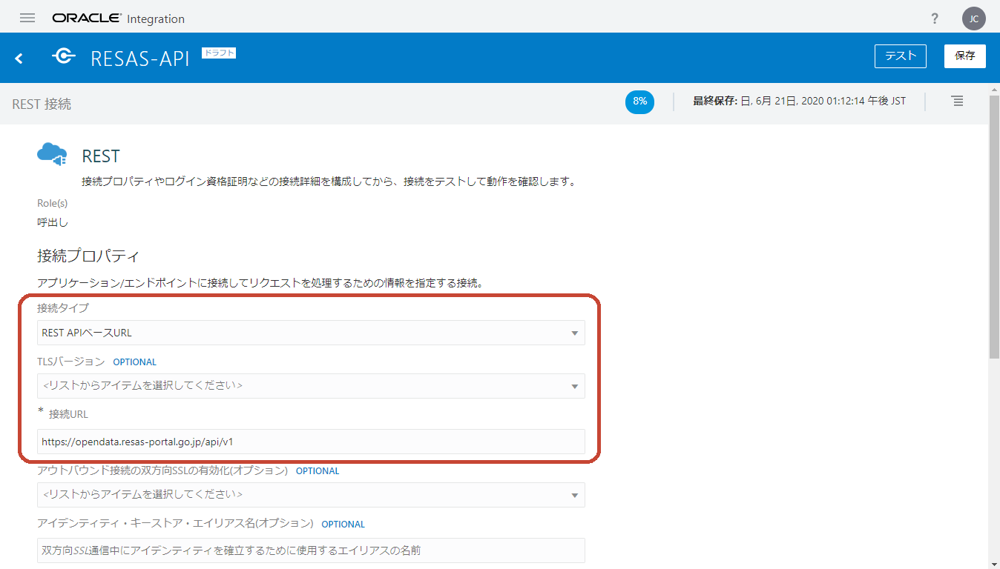

1.  **「セキュリティ」** セクションでは、次のように値を入力します。

    | 入力項目 | 入力する値 |
    |:----|:----|
    | **「セキュリティ・ポリシー」** | **「API Key Based Authentication」** を選択 |
    | **「APIキー」** | RESAS-API から発行された API キーを入力 |
    | **「APIキーの用途」** | `-H X-API-KEY: ${api-key}` |

    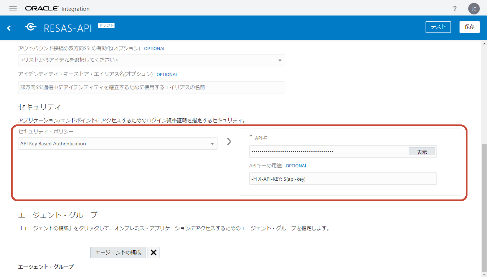

1.  **「接続プロパティ」** と **「セキュリティ」** セクションの値を入力したら、ページの右上に表示されている **「テスト」** ボタンをクリックします。

    

    **「接続プロパティ」** で指定した値が正しければ、ページの右上に成功したことを表すメッセージ **「接続 <接続名> が正常にテストされました。」** が表示されます。

1.  テストに成功したら、ページの右上に表示されている **「保存」** ボタンをクリックします。

    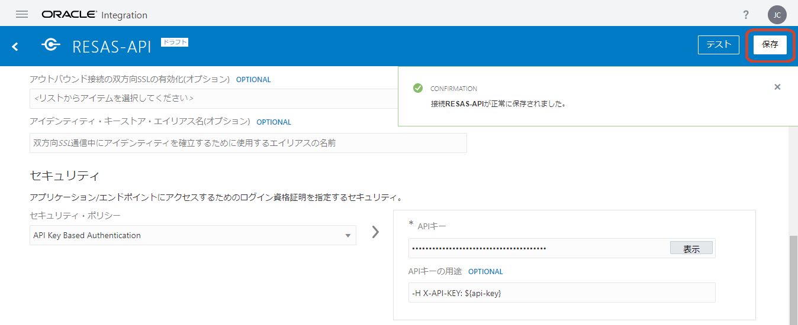

1.  保存できたら、ページの左上に表示されている **「<」** （戻る）アイコンをクリックして、 **「接続」** ページに戻ります。

    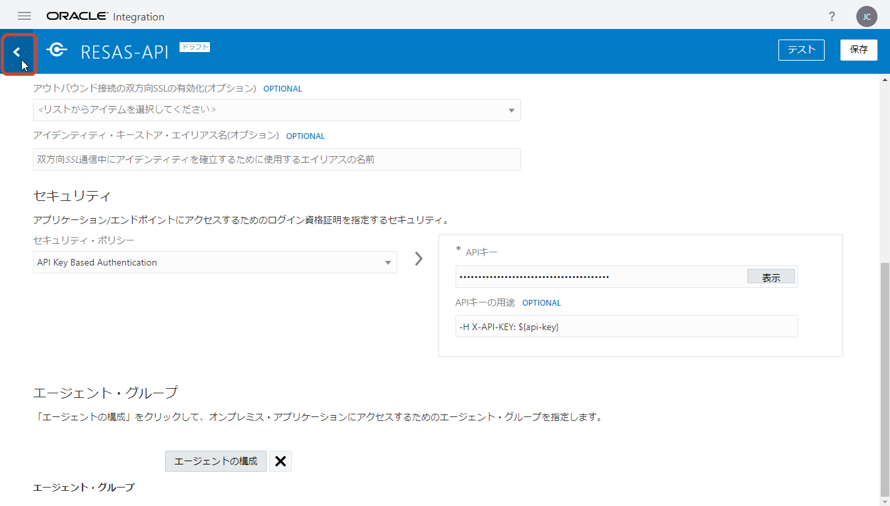

### Oracle ADW アダプタを使用した接続

#### Oracle ADW のウォレット・ファイルのダウンロード

Oracle ADW のデータベースにアクセスするには、ウォレット・ファイルが必要になります。
ウォレット・ファイルをダウンロードする手順は次のとおりです。

1.  OCI コンソールにログインします。
    ページの左側にあるナビゲーション・メニューから **「データベース」** セクションの **「Autonomous Data Warehouse」** を選択します。

1.  使用する ADW インスタンスが作成された **「リージョン」** と **「コンパートメント」** を選択します。
    使用する ADW インスタンスの表示名をクリックして詳細ページを開きます。
    **「DB接続」** ボタンをクリックします。

1.  **「DB接続」** ボックスが表示されます。
    **「ウォレット・タイプ」** では **「インスタンス・ウォレット」** を選択して、 **「ウォレットのダウンロード」** ボタンをクリックします。

1.  **「ウォレットのダウンロード」** ボックスが表示されます。
    ウォレットのパスワードを指定する必要があります。
    **「パスワード」** と **「パスワードの確認」** にパスワードを指定します。
    ここで指定したパスワードは、 Oracle Integration Cloud で接続を作成する際に必要なので、忘れないようにしてください。

    **「ダウンロード」** ボタンをクリックすると、ウォレット・ファイル `wallet_<DB名>.zip` がダウンロードされます。

1.  ダウンロードしたウォレット・ファイル `wallet_<DB名>.zip` に含まれているファイル `tnsnames.ora` を任意のテキスト・エディタで開き、接続に必要なホスト名とサービス名を確認します。
    `tnsnames.ora` には次のような3つのエントリが記述されています（改行を追加しています）。

    ```txt
    <DB名>_high = (description=
        (retry_count=20)
        (retry_delay=3)
        (address=(protocol=tcps)(port=1522)(host=xxx.yyy.oraclecloud.com))
        (connect_data=(service_name=zzzzz_<DB名>_high.adwc.oraclecloud.com))
        (security=(ssl_server_cert_dn="CN=adwc.uscom-east-1.oraclecloud.com,OU=Oracle BMCS US,O=Oracle Corporation,L=Redwood City,ST=California,C=US")))

    <DB名>_low = (description=
        (retry_count=20)
        (retry_delay=3)
        (address=(protocol=tcps)(port=1522)(host=xxx.yyy.oraclecloud.com))
        (connect_data=(service_name=zzzzz_<DB名>_low.adwc.oraclecloud.com))
        (security=(ssl_server_cert_dn="CN=adwc.uscom-east-1.oraclecloud.com,OU=Oracle BMCS US,O=Oracle Corporation,L=Redwood City,ST=California,C=US")))

    <DB名>_medium = (description=
        (retry_count=20)
        (retry_delay=3)
        (address=(protocol=tcps)(port=1522)(host=xxx.yyy.oraclecloud.com))
        (connect_data=(service_name=zzzzz_<DB名>_medium.adwc.oraclecloud.com))
        (security=(ssl_server_cert_dn="CN=adwc.uscom-east-1.oraclecloud.com,OU=Oracle BMCS US,O=Oracle Corporation,L=Redwood City,ST=California,C=US")))
    ```

    ホスト名は、 各エントリ内の `(address=(protocol=tcps)(port=1522)(host=xxx.yyy.oraclecloud.com))` で指定されている `host` の値です。
    この例では、 `xxx.yyy.oraclecloud.com` です
    （`xxx.yyy` の部分は、使用するウォレット・ファイル内の `tnsnames.ora` に記述されているものと置き換えてください）。

    サービス名は、次の3つのうちのどれか1つを選択できます:
    - `<DB名>_high`
    - `<DB名>_low`
    - `<DB名>_medium`
    今回は、 `<DB名>_medium` を使用することにします。
    （`<DB名>` は、使用するウォレット・ファイル内の `tnsnames.ora` に記述されているものと置き換えてください）

#### Oracle Integration Cloud で接続を作成

ウォレット・ファイルをダウンロードし、接続情報を確認できたら、 Oracle Integration Cloud で ADW アダプタを使用した接続を作成します。
接続を作成する手順は次のとおりです。

1.  Oralce Integration Cloud にログインし、 **「接続」** ページを開きます。
    **「接続」** ページの右上にある **「作成」** ボタンをクリックします。

    

1.  **「接続の作成 - アダプタの選択」** ボックスが表示されたら、 **「検索」** フィールドに `ADW` と入力して、表示を絞り込みます。

    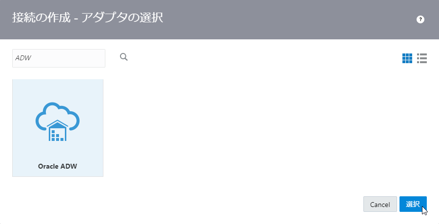

    表示された **「Oracle ADW」** アイコンをクリックしてから右下の **「選択」** ボタンをクリックします。

1.  **「接続の作成」** ボックスが表示されます。
    作成する接続の基本情報を入力します。

    | 入力項目 | 入力する値 |
    |:----|:----|
    | **「名前」** | My ADW |
    | **「識別子」** | MY_ADW |
    | **「ロール」** | **「呼び出し」** を選択 |

    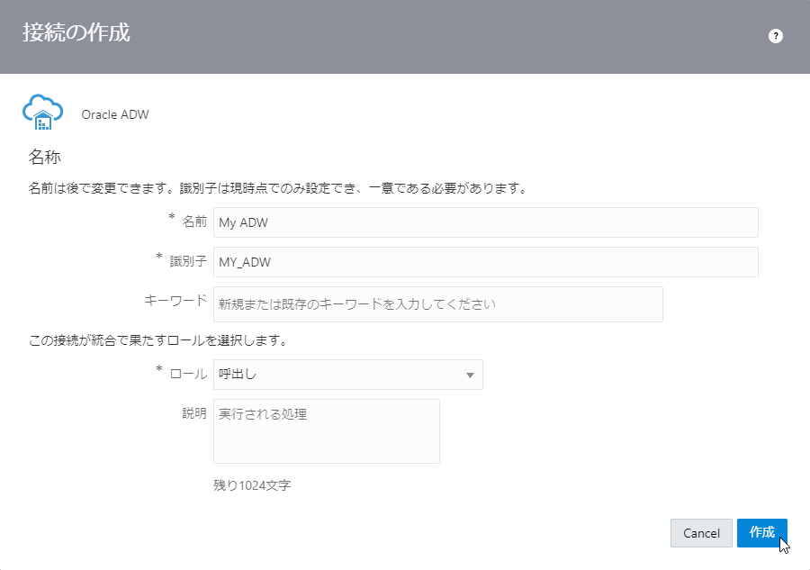

    入力したら右下の **「作成」** ボタンをクリックします。

1.  接続の詳細を入力するページが表示されます。
    **「接続プロパティ」** セクションでは、次のように値を入力します。

    | 入力項目 | 入力する値 |
    |:----|:----|
    | **「Host」** | ウォレット・ファイル内の `tnsnames.ora` から取得したホスト名 |
    | **「Port」** | 入力しない |
    | **「SID」** | 入力しない |
    | **「Service Name」** | `<DB名>_medium` （`<DB名>` は、使用する環境のものと置き換えてください） |

    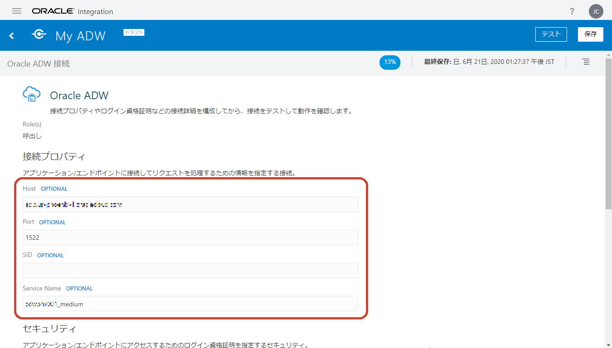

1.  **「セキュリティ」** セクションでは、次のように値を入力します。

    | 入力項目 | 入力する値 |
    |:----|:----|
    | **「セキュリティ・ポリシー」** | **「JDBC Over SSL」** を選択 |
    | **「ウォレット」** | アップロードボタンをクリックして、ウォレット・ファイル `wallet_<DB名>.zip` をアップロード |
    | **「ウォレット・パスワード」** | ウォレット・ファイルをダウンロードする際に指定したパスワードを入力 |
    | **「データベース・サービス・ユーザー名」** | ADW インスタンスのユーザー名を入力 |
    | **「パスワード」** | ADW インスタンスのユーザーのパスワードを入力 |

    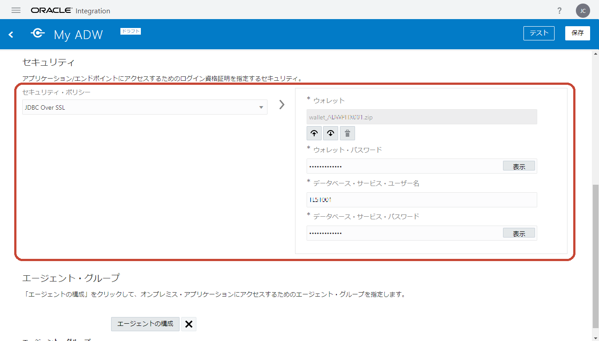

1.  **「接続プロパティ」** と **「セキュリティ」** の値を入力したら、ページの右上に表示されている **「テスト」** ボタンをクリックします。

    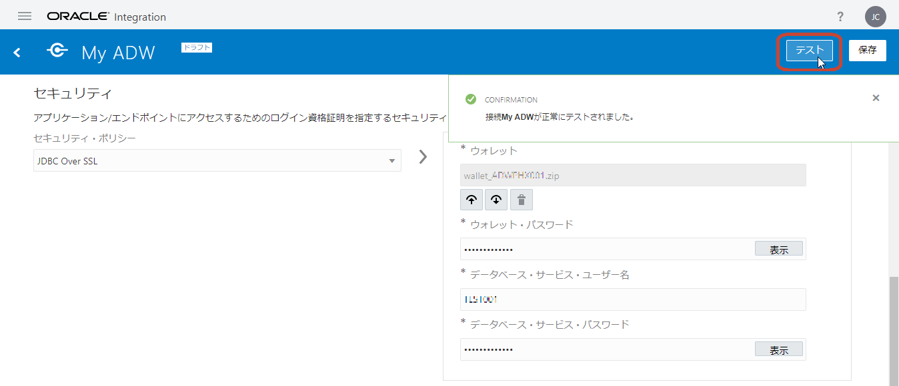

    接続のテストに成功すると、 **「接続 *<接続名>* が正常にテストされました。」** というメッセージがページの右上に表示されます。

1.  テストに成功したら、ページの右上に表示されている **「保存」** ボタンをクリックします。

    

    保存できたら、ページの左上にある **「<」** （戻る） アイコンをクリックして、**「接続」** ページに戻ります。

## 統合の作成

Oracle Integration Cloud の "統合" は、システム間の連携の流れを定義したものです。
このチュートリアルで作成する統合は、次の処理を実行します。

1. RESAS-API の市区町村 API を呼び出し、データを取得
1. 取得したデータを Oracle ADW のテーブルに保存

### 統合の新規作成

1.  Oralce Integration Cloud にログインします。
    **「接続」** ページを開いている場合は、ナビゲーション・ペインで **「統合」** をクリックします。

    **「ようこそ」** または **「ホーム」** ページを開いている場合は、ナビゲーション・ペインで **「統合」** をクリックして **「統合」** のメニューを開き、 **「統合」** を選択します。

1.  **「統合」** ページが表示されたら、ページの右上にある **「作成」** ボタンをクリックします。

    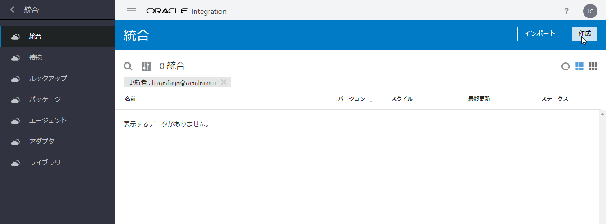

1.  **「統合スタイルの選択」** ボックスが表示されます。
    **「スケジュールされたオーケストレーション」** をクリックしてから、ボックスの右下にある **「作成」** ボタンをクリックします。

    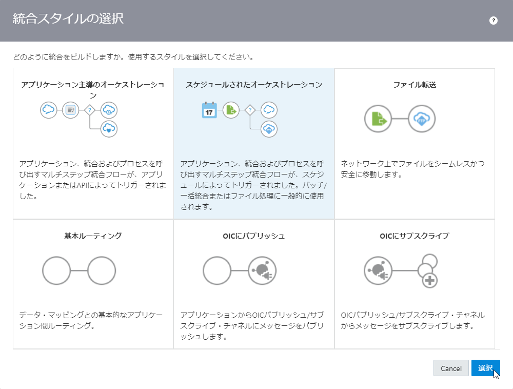

1.  **「新規統合の作成」** ボックスが表示されます。
    次の情報を入力する必要があります。

    | 入力項目 | 入力する値 |
    |:----|:----|
    | **「統合にどのような名前をつけますか。」** | `Load Cities` |
    | **「識別子」** | `LOAD_CITIES` (Load Cities と名前をつけると自動的に設定される) |
    | **「バージョン」** | `01.00.0000` （初期状態で入力されている値をそのまま使用） |
    | **「Documentation URL」** | 入力しない |
    | **「この統合では何が行われますか。」** | 入力しない |
    | **「Which keyword defines this integration」** | 入力しない |

    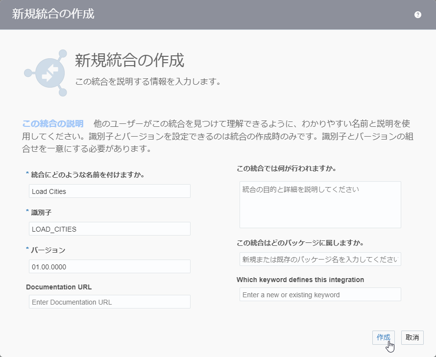

    入力したら右下の **「作成」** ボタンをクリックします。

1.  統合が作成されると、キャンバス・ビューで表示されます。
    **「レイアウト」** を初期状態の **「垂直」** から **「水平」** に変更します。

    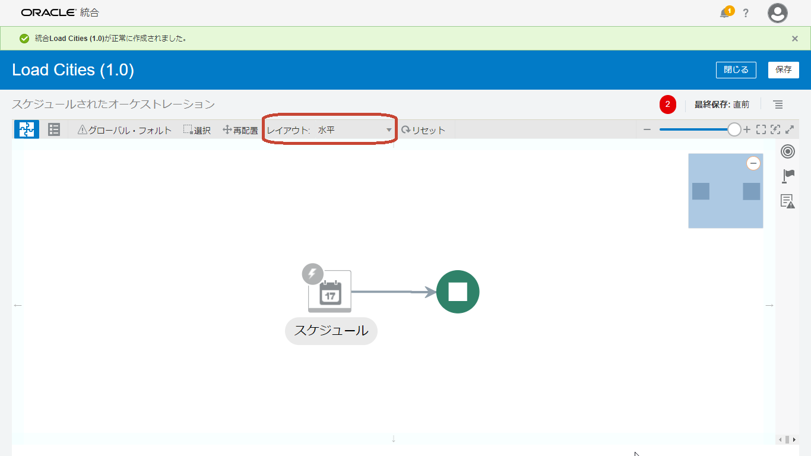

1.  **「スケジュール」** アイコンを選択すると表示される **「スケジュール・パラメータの編集」** アイコンをクリックします。

    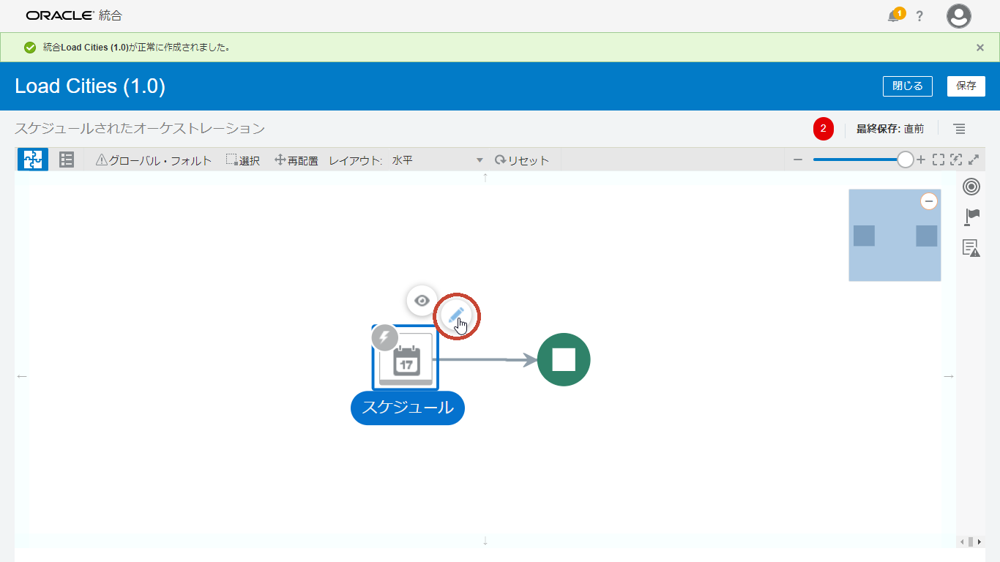

1.  **「スケジュール・パラメータ」** ページが表示されます。
    ページの右下にある **「追加」** アイコンをクリックします。

    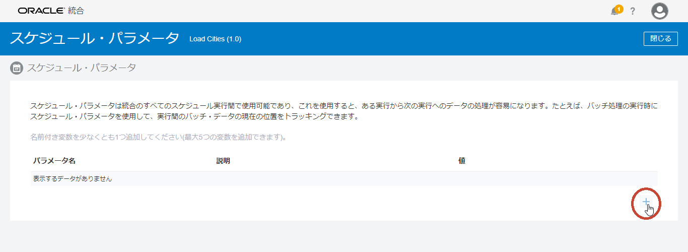

1.  **「パラメータ名」** に `prefCode`、 **「値」** に `1` と入力します。

    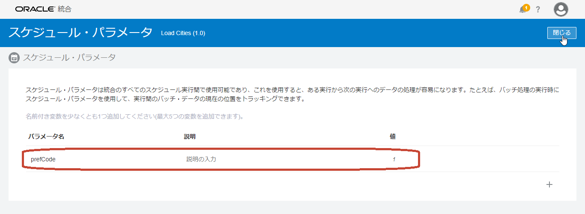

    入力し終わったらページの右上にある **「閉じる」** ボタンをクリックします。

### RESAS-API 呼び出しの設定

1.  キャンバス・ビューの右端に表示されている **「呼び出し」** アイコンをクリックします。
    ロールが呼び出しに設定されている接続のリストが表示されます。
    **「REST」** をクリックして、『RESAS-API 呼び出しのための REST アダプタ接続』で作成した接続を見つけます。

1.  『RESAS-API 呼び出しのための REST アダプタ接続』で作成した接続を、キャンバス・ビューの **「スケジュール」** アイコンから **「停止」** アイコン（背景が緑色のアイコン）に向けられた矢印の上にドラッグし、表示された **「＋」** マークの上でドロップします。

1.  **「REST エンドポイントの構成」** ボックスが表示されます。
    **「基本情報」** では、次のように入力します。

    | 入力項目 | 入力する値 |
    |:----|:----|
    | **「エンドポイントにどのような名前をつけますか。」** | `GetCities` |
    | **「エンドポイントの相対リソースURIは何ですか。」** | `/cities` |
    | **「エンドポイントでどのアクションを実行しますか。」** | **「GET」** を選択 |
    | **「このエンドポイントのパラメータを追加して確認」** | チェックする |
    | **「このエンドポイントを構成してレスポンスを受信」** | チェックする |

    入力したら、**「REST エンドポイントの構成」** ボックスの右上の方にある **「次」** ボタンをクリックします。

1.  **「REST エンドポイントの構成」** ボックスの **「リクエスト・パラメータ」** では、RESAS-API を呼び出す際に指定する問合せパラメータを指定します。
    **「問合せパラメータの指定」** セクションにあるテーブルの **「＋」** アイコンをクリックし、次のように入力します。

    | 入力項目 | 入力する値 |
    |:----|:----|
    | **「名前」** | `prefCode` |
    | **「データ型」** | **「integer」** を選択 |

    入力し終わったら、**「次」** ボタンをクリックします。

1.  **「REST エンドポイントの構成」** ボックスの **「レスポンス」** では、 REST-API から返ってくるレスポンスの形式を指定します。
    **「レスポンス・ペイロード」** で **「JSONサンプル」** を選択してから、 **「<<< inline >>>」** リンクをクリックします。

1.  **「REST エンドポイントの構成」** ボックスの **「Enter Sample JSON」** に、RESAS-API の市区町村一覧が返すレスポンスのサンプルを入力します。
    [RESAS-API の市区町村一覧のドキュメント](https://opendata.resas-portal.go.jp/docs/api/v1/cities.html) の **「sample」** セクションの JSON のコードブロックか、次のコードブロックをコピーして、**「Enter Sample JSON」** のテキストエリアに、ペーストします。

    ```json
    {
        "message": null,
        "result": [{
            "prefCode": 1,
            "cityCode": "01100",
            "cityName": "札幌市",
            "bigCityFlag": "2"
        }, {
            "prefCode": 1,
            "cityCode": "01101",
            "cityName": "札幌市中央区",
            "bigCityFlag": "1"
        }, {
            "prefCode": 1,
            "cityCode": "01102",
            "cityName": "札幌市北区",
            "bigCityFlag": "1"
        }, {
            "prefCode": 1,
            "cityCode": "01103",
            "cityName": "札幌市東区",
            "bigCityFlag": "1"
        }, {
            "prefCode": 1,
            "cityCode": "01104",
            "cityName": "札幌市白石区",
            "bigCityFlag": "1"
        }, {
            "prefCode": 1,
            "cityCode": "01105",
            "cityName": "札幌市豊平区",
            "bigCityFlag": "1"
        }]
    }
    ```

    **「OK」** ボタンをクリックします。

1.  **「REST エンドポイントの構成」** ボックスの右上にある **「次」** ボタンをクリックします。

1.  **「REST エンドポイントの構成」** ボックスの **「サマリー」** が表示されます。
    右上に表示される **「完了」** ボタンをクリックします。

1.  キャンバス・ビューは次の図のような表示になっています。

    - **「マップ先 GetCities」** は、REST API のリクエストにパラメータを指定する必要がある場合に使用するマッピングです。
      このチュートリアルでは、スケジュール・パラメータ `prefCode` で指定した値を RESAS-API を呼び出す際に指定する問い合わせパラメータにマップする設定を行います。
    - **「GetCities」** は、これまでに設定した REST API の呼び出しの設定です。

1.  キャンバス・ビューで **「マップ先 GetCities」** を選択し、表示された **「編集」** ボタンをクリックします。

1.  **「マップ先 GetCities」** ページが表示されます。

    ページの左側に表示される **「Sources」** ツリーに **「$prefCode」** が表示されていることを確認します。
    この **「$prefCode」** は、先ほど設定したスケジュール・パラメータです。

    次に、ページの右側に表示されている **「Targets」** ツリーに **「execute」** → **「QueryParameters」** → **「prefCode」** が表示されていることを確認します。
    この **「prefCode」** は、RESAS-API の市区町村一覧 API を呼び出す際に指定する問い合わせパラメータです。

1.  **「Sources」** ツリーの **「$prefCode」** を、 **「Targets」** ツリーの **「prefCode」** の上にドラッグ＆ドロップします。

    **「Sources」** ツリーの **「$prefCode」** を、 **「Targets」** ツリーの **「prefCode」** が直線で結ばれます。
    ページの右上にある **「検証」** ボタンをクリックし、 **「マッピングは有効で、使用する準備ができています。」** というメッセージが表示されたら、 **「閉じる」** ボタンをクリックします。

1.  これで、RESAS-API の市区町村一覧を取得するための設定が終わりました。
    ここまでの設定を保存するために、ページの右上に表示される **「保存」** ボタンをクリックします。

### Oracle ADW へのデータの書き込み

1.  キャンバス・ビューの右端に表示されている **「呼び出し」** アイコンをクリックします。
    **「Oracle ADW」** をクリックして、『Oracle ADW アダプタを使用した接続』で作成した接続を見つけます。

1.  『Oracle ADW アダプタを使用した接続』で作成した接続を、キャンバス・ビューの **「GetCities」** アイコンから **「停止」** アイコン（背景が緑色のアイコン）に向けられた矢印の上にドラッグし、表示された **「＋」** マークの上でドロップします。

1.  **「Oracle Adapter Configuration Wizard」** が表示されます。
    次のように **「基本情報」** を入力します。

    |入力項目|入力する値|
    |:----|:----|
    | **「エンドポイントにどのような名前をつけますか。」** | `MergeCities` |
    | **「どの操作を実行しますか。」** | **「Perform an Operation on a Table」** を選択 |
    | **「どの操作を表で実行しますか。」** | **「Insert or Update (Merge)」** を選択 |

    入力し終わったら、 **「次」** ボタンをクリックします。

1.  **「Oracle Adapter Configuration Wizard」** の **「表での操作」** が表示されます。
    **「スキーマ」** では、市区町村データを保存する `CITIES` 表のスキーマを選択し、 **「表タイプ」** では **「TABLE」** が選択されていることを確認したら、 **「表名」** フィールドの右隣にある **「検索」** ボタンをクリックします。

    **「使用可能」** リストに **「CITIES」** が表示されています。
    **「CITIES」** を選択した状態で、 **「>」** ボタンをクリックします。
    **「CITIES」** が、 **「選択済み」** リストに異動したことを確認したら、 **「インポート」** ボタンをクリックします。

1.  **「親データベース表の選択」** が表示されます。
    今回はデータを保存するのテーブルは `CITIES` だけなので、初期状態のままでウィザードの右上にある **「次」** ボタンをクリックします。

1.  **「Oracle Adapter Configuration Wizard」** の **「サマリー」** が表示されます。
    ウィザードの右上にある **「完了」** ボタンをクリックします。

1.  キャンバス・ビューは次の図のような表示になっています。

    - **「マップ先 MergeCities」** は、 Oracle ADW に保存するデータのマッピングの設定を行います。
      次のセクションで設定します。
    - **「MergeCities」** は、これまでに設定した Oracle ADW の呼び出しの設定です。

1.  これで、RESAS-API の市区町村一覧のデータを Oracle ADW に保存するための設定が終わりました。
    ここまでの設定を保存するために、ページの右上に表示される **「保存」** ボタンをクリックします。

### データ・マッピングの設定

ここでは、RESAS-API により取得した市区町村一覧データと、Oracle ADW に保存するデータのマッピングの設定を行います。

1.  キャンバス・ビューで、 **「マップ先 MergeCities」** を選択します。
    表示される **「編集」** アイコンをクリックします。

1.  データのマッピングの設定を行うためのマッパーが表示されます。
    マッパーの画面左側に表示されている **「Sources」** ペインの **「$GetCities」** → **「executeResponse」** → **「response-wrapper」** → **「result」** と、画面右側に表示されている **「Target」** ペインの **「CitiesCollection」** → **「Cities」** にドラッグ＆ドロップします。

1.  **「Sources」** ペインの **「$GetCities」** → **「executeResponse」** → **「response-wrapper」** → **「result」** → **「prefCode」** を、 **「Target」** ペインの **「CitiesCollection」** → **「Cities」** → **「prefCode」** にドラッグ＆ドロップします。

1.  **「Sources」** ペインの **「$GetCities」** → **「esecuteResponse」** → **「response-wrapper」** → **「result」** → **「cityCode」** を、 **「Target」** ペインの **「CitiesCollection」** → **「Cities」** → **「cityCode」** にドラッグ＆ドロップします。

1.  **「Sources」** ペインの **「$GetCities」** → **「esecuteResponse」** → **「response-wrapper」** → **「result」** → **「cityName」** を、 **「Target」** ペインの **「CitiesCollection」** → **「Cities」** → **「cityName」** にドラッグ＆ドロップします。

1.  **「Sources」** ペインの **「$GetCities」** → **「esecuteResponse」** → **「response-wrapper」** → **「result」** → **「bigCityFlag」** を、 **「Target」** ペインの **「CitiescturesCollection」** → **「Cities」** → **「bigCityFlag」** にドラッグ＆ドロップします。

1.  画面左上にある **「検証」** ボタンをクリックして、マッピングが有効かどうかを確認します。
    画面の上部に **「マッピングは有効で使用する準備ができています。」** というメッセージが表示されたら、 **「閉じる」** ボタンをクリックします。

### トラッキングの設定

Oracle Integration Cloud では、作成した統合が実行状況をトラッキングするための設定を行う必要があります。
トラッキングの設定は次の手順で行います。

1.  統合キャンバスの右上にあるアクション・アイコンをクリックします。
    表示されたメニューから **「トラッキング」** を選択します。

1.  **「トラッキング用のビジネス識別子」** ボックスが表示されます。
    ボックス左側のツリーから **「schedule」** の下の **「startTime」** を、ボックスの右側に表示されているテーブルの **「トラッキング・フィールド」** 列の1行目にドラッグ＆ドロップします。

1.  ボックス左側のツリーから **「$prefCode」** を、ボックスの右側に表示されているテーブルの **「トラッキング・フィールド」** 列の2行目にドラッグ＆ドロップします。

    ボックスの右下にある **「閉じる」** ボタンをクリックします。

1.  ページの右上にある **「保存」** ボタンをクリックしてから **「閉じる」** ボタンをクリックします。
    **「統合」** の一覧が表示されるページに戻ります。

## 統合の実行

作成した統合を実行してみましょう。

1.  Oracle Integration Cloud で作成した統合を実行するには、まずアクティブ化します。
    実行する統合にマウスポインタを合わせ、表示された **「アクティブ化」** アイコンをクリックします。

1.  **「統合のアクティブ化」** ボックスが表示されます。
    ボックスの右下に表示されている **「アクティブ化」** ボタンをクリックします。

1.  ページの右上にあるリフレッシュ・アイコンをクリックし、統合のステータスが **「アクティブ」** に変更されていることを確認します。

1.  実行する統合にマウスポインタを合わせ、表示された **「実行」** アイコンをクリックします。
    ポップアップの下に表示されている **「すぐに送信」** リンクをクリックします。

1.  **「スケジュール・パラメータ」** ページが表示されます。
    今回はデフォルト値をそのまま使用することにして、ページの右上にある **「送信」** ボタンをクリックします。

1.  ナビゲーション・ペインで **「<」** アイコンをクリックし、 **「Oracle Integration」** のメニューを表示させます。
    **「モニタリング」** → **「統合」** → **「トラッキング」** を選択します。

1.  **「インスタンスのトラッキング」** ページが表示されます。
    ステータスが **「成功」** と表示されていることを確認します。

1.  インスタンスにマウス・ポインタを合わせると表示される **「詳細の表示」** アイコンをクリックします。
    アクティビティ・ストリームが表示され、処理の流れが確認できます。

以上でこのチュートリアルは終了です。
